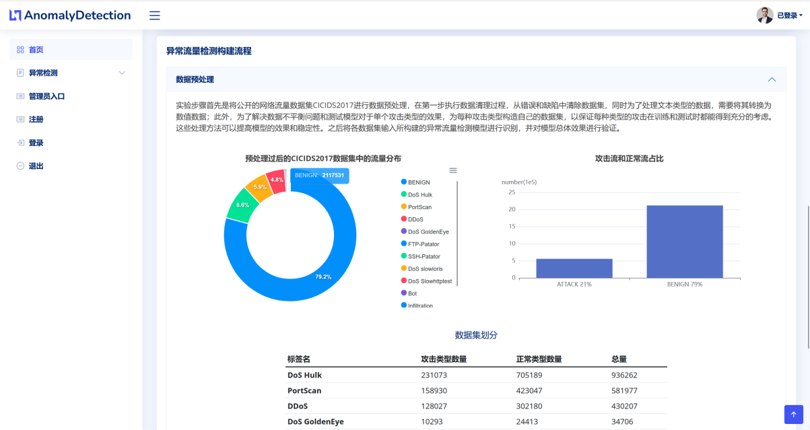
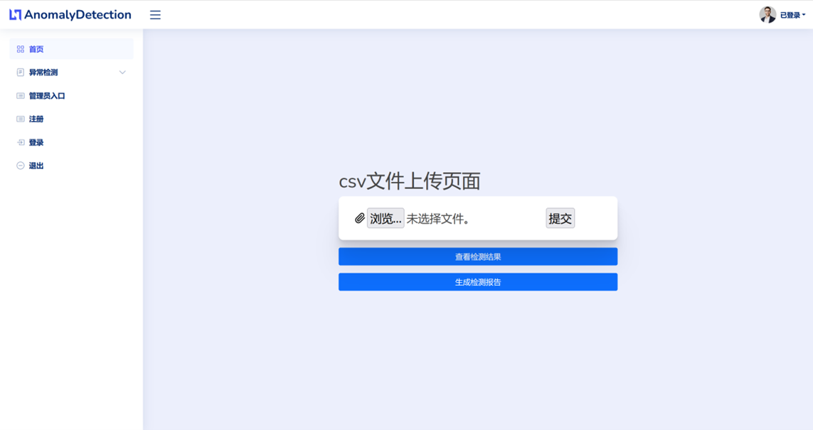
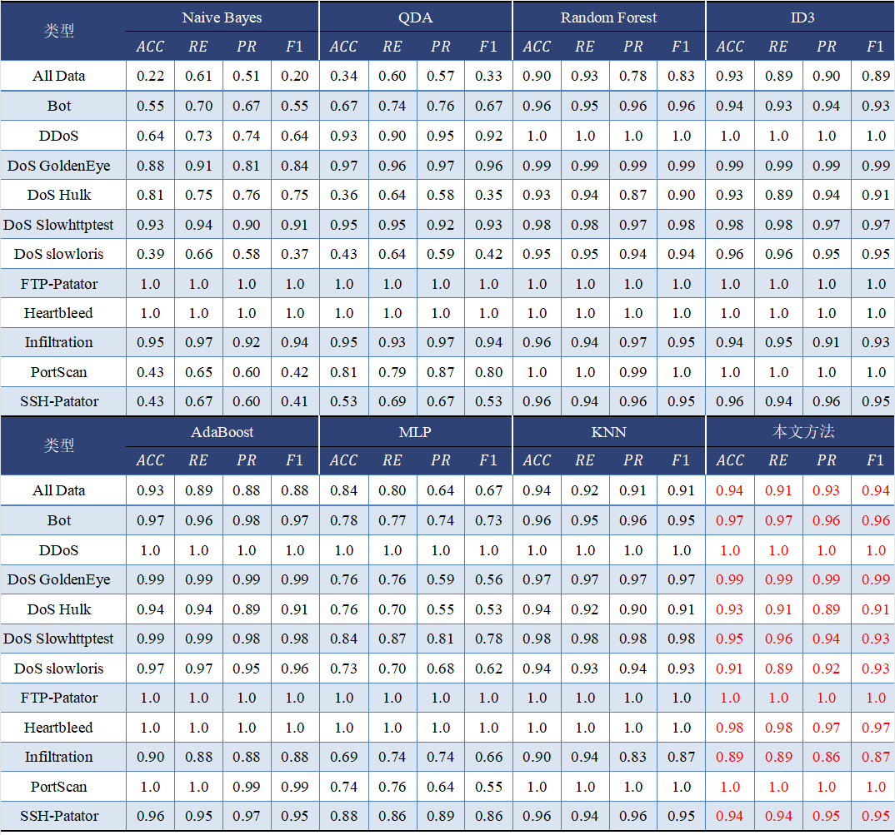

# Anomaly Detection


## 数据集
[CIC-IDS2017](https://www.unb.ca/cic/datasets/ids-2017.html)
文件必须在"CSVs"文件夹中，与程序位于同一位置。

## IDE工具
[Pycharm](https://www.jetbrains.com/pycharm/)

## 数据库工具
[MySQL 8.0.32](https://downloads.mysql.com/archives/installer/)  [Navicat Premium 16](https://www.navicat.com.cn/products)


## 一、Graduation_project项目：系统构建项目
### 项目环境：
[myenvs]
Anaconda（[Anaconda3-2019.10-Windows-x86_64.exe](https://mirrors.tuna.tsinghua.edu.cn/anaconda/archive/))  python=3.7
tensorflow==1.15.0
django==2.2.5
scikit-learn==0.21.3
h5py==3.8.0
keras==2.3.1
joblib==1.2.0
Bottleneck==1.3.4
certifi==2022.5.18.1
pip==22.3.1
scipy==1.6.2
six==1.16.0
wheel==0.38.4
setuptools==65.6.3
pytz==2023.3
pymysql==1.0.3
pandas==1.3.5
numpy==1.19.2
mkl-fft==1.3.1
mkl-random==1.2.2
matplotlib==3.5.3
numexpr==2.7.3
markdown==3.4.3


## 二、research项目：模型构建项目
### 模型构建过程分为5个步骤：
### 几乎每个程序的输出都是下一个程序运行的先决条件
1. Pre-processing

2. Statistics
3. Attack Filtering
4. Feature Selection
5. Algorithm Implementation

## 项目环境：
[tensorflow_gpu]
Python 3.10
TensorFlow-gpu 2.10.0
Keras 2.10.0
win10/win11系统安装Tensorflow-GPU(https://blog.csdn.net/kamille1024/article/details/127022034)


|  | |   |
| ------ |--|  ------ |
|Central Processing Unit|:|12th Gen Intel(R) Core(TM) i9-12900H @ 2.50 GHz CPU|
| Random Access Memory	|:|	16 GB RAM|
| Operating System	|:|	Windows 11 22H2 |
| Graphics Processing Unit	|:|	NVIDIA GeForce RTX 3060 Laptop GPU|


## 系统运行
```
cd Graduation_project
python manage.py runserver
```


## 系统效果






